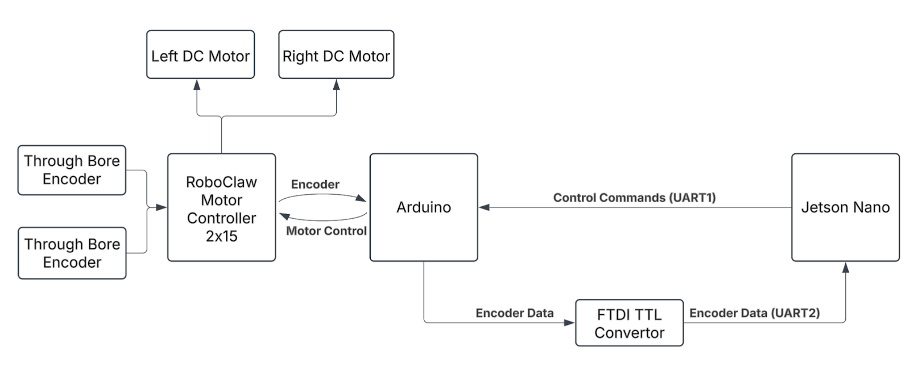
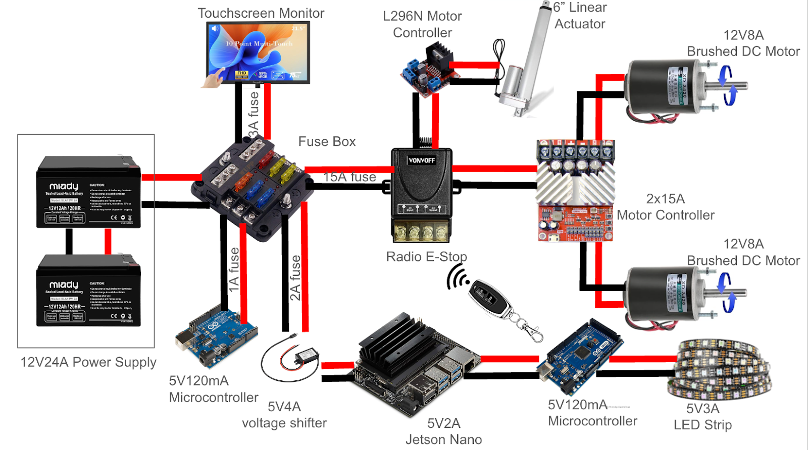

# SmoothOperator - Hardware Report

## Table of Contents
- [1. Project Overview](#1-project-overview)
- [2. System Block Diagram](#2-system-block-diagram)
- [3. Bill of Materials (BOM)](#3-bill-of-materials-bom)
- [4. Mechanical Design Overview](#4-mechanical-design-overview)
- [5. Schematics and CAD Files](#5-schematics-and-cad-files)
- [6. Power System Details](#6-power-system-details)
- [7. Assembly and Wiring Instructions](#7-assembly-and-wiring-instructions)
- [8. Photos of Assembled System](#8-photos-of-assembled-system)
- [9. Significant Datasheets and References](#9-significant-datasheets-and-references)
- [10. Future Hardware Recommendations](#10-future-hardware-recommendations)

---

## 1. Project Overview
SmoothOperator is a full-scale robotic luggage assistant designed for dynamic obstacle avoidance and teleoperated control. The hardware system consists of a custom aluminum chassis, lifting mechanism, lead-acid battery pack, sensor suite, and motor control system integrated around a Jetson Nano and Arduino Mega controller stack.

## 2. System Block Diagram
(Insert block diagram showing:
- Jetson Nano ⇄ Arduino Mega ⇄ Motor Controllers
- Sensor Bus (Ultrasonics, Limit Switches, Encoders)
- Power Distribution from Batteries to Controllers)

## 3. Bill of Materials (BOM)

| Item # | Description | Quantity | Unit Cost | Extended Cost |
|:------:|:------------|:---------:|:---------:|:-------------:|
| 1 | Clamping Shaft Collar - 1/2" Hex ID | 4 | $0.99 | $3.96 |
| 2 | 8020 1"x2" T-Slotted Aluminum Extrusion, 72" | 3 | $47.43 | $142.29 |
| 3 | 8020 1"x1" T-Slotted Aluminum Extrusion, 72" | 5 | $33.25 | $166.25 |
| 4 | 85t Timing Belt (HTD 5mm) | 2 | $6.99 | $13.98 |
| 5 | 2" High Double Rail End Caps | 6 | $3.05 | $18.30 |
| 6 | 6061 Aluminum U-Channel (1 ft) | 1 | $9.55 | $9.55 |
| 7 | High Torque DC Motors (12V/24V) | 2 | $25.79 | $51.58 |
| 8 | Flanged Bearings (0.500" Hex ID) | 6 | $1.49 | $8.94 |
| 9 | Aluminum Pulley 15t (HTD 5mm) | 4 | $9.99 | $39.96 |
| 10 | Stainless Button Head Hex Screws | 2 | $6.76 | $13.52 |
| 11 | T-Slotted Framing End-Feed Nuts | 3 | $7.83 | $23.49 |
| 12 | ⅛” Custom Laser-Cut Acrylic Sheets | 1 | $288.26 | $288.26 |
| 13 | Caster Wheels | 4 | $7.65 | $30.60 |
| 14 | Colson Performa Wheels (4"x0.875") | 2 | $7.49 | $14.98 |
| 15 | 1/2" OD Hex Stock (18") | 1 | $4.49 | $4.49 |
| 16 | 90° 8020 Brackets | 12 | $8.00 | $96.00 |
| 17 | PLA 3D Printed Parts | 1 | $3.00 | $3.00 |
| 18 | ABS 3D Printed Parts | 1 | $2.16 | $2.16 |
| 19 | 12V 6” DC Linear Actuator | 1 | $30.99 | $30.99 |
| 20 | Pool Noodles | 4 | $1.25 | $5.00 |
| 21 | RoboClaw Motor Controller | 1 | $99.99 | $99.99 |
| 22 | REV Through Bore Encoders | 2 | $49.00 | $105.53 |
| 23 | SparkFun 9DoF IMU | 1 | $18.50 | $18.50 |
| 24 | 6-Circuit 12V Fuse Box | 1 | $21.99 | $21.99 |
| 25 | Arduino Mega 2560 R3 | 1 | $22.99 | $22.99 |
| 26 | Jetson Nano (4GB RAM, 16GB Storage) | 1 | $229.99 | $229.99 |
| 27 | FT232RL USB to TTL Adapter | 1 | $6.49 | $6.49 |
| 28 | USB 3.0 Hub | 1 | $6.36 | $6.36 |
| 29 | Touchscreen Monitor | 1 | $127.49 | $127.49 |
| 30 | WS2812B RGB LED Strip (300 Pixels) | 1 | $22.99 | $22.99 |
| 31 | Arduino Uno R3 | 1 | $14.99 | $14.99 |
| 32 | HC-SR04 Ultrasonic Sensors | 3 | $1.91 | $5.73 |
| 33 | Logitech C270 HD Webcam | 1 | $19.99 | $19.99 |
| 34 | L298N Motor Driver | 1 | $6.19 | $6.19 |
| 35 | RPLiDAR A1 | 1 | $99.00 | $99.00 |
| 36 | NO Limit Switches | 8 | $1.29 | $10.32 |
| 37 | 12V12A Lead-Acid Batteries (2-Pack) | 1 | $39.99 | $39.99 |
| 38 | Male DC Barrel Jack Connectors | 2 | $2.00 | $4.00 |
| 39 | Female DC Barrel Jack Connectors | 3 | $2.00 | $6.00 |
| 40 | 22AWG Solid Core Wires (variety) | 1 | $10.00 | $10.00 |
| 41 | 12V to 5V 4A Power Step-Down Converter | 1 | $8.99 | $8.99 |
| 42 | Radio E-Stop | 1 | $15.99 | $15.99 |
| 43 | Custom Arduino Mega PCB Board | 1 | $1.29 | $1.29 |
| 44 | Screw Terminals (various sizes) | 8 | $0.50 | $4.00 |
| 45 | Female Spade Connectors | 14 | $0.69 | $9.66 |
| 46 | Intelligent 12V/24V Battery Charger | 1 | $32.99 | $32.99 |

### **Total Cost**: $1,918.75

## 4. Mechanical Design Overview
### Frame
The frame of SmoothOperator largely consists of 8020 T-slotted aluminum extrusions fastened into a U-shape using corner brackets and ¼”-20 screws. 1”x2” profile 8020 was used for the base to provide greater strength to the drivetrain and lower the center of gravity, improving stability. The rest of the frame was constructed from 1”x1” profile 8020 to balance cost and structural stability. The final frame dimensions are 2’x2’x4.25’, allowing the robot to carry luggage up to 14”x16”x30” in size.

### Drivetrain
The drivetrain features two Colson Performa wheels mounted centrally and four caster wheels at the corners, totaling six wheels. The central drive wheels slightly tilt the robot backward to ensure continuous ground contact and assist with luggage retention during motion. The wheels' thermoplastic elastomer tread helps reject small debris. The positioning of the wheels enables the robot to perform 0° point turns. A 10:1 compound gear reduction system is implemented, using a combination of 15-tooth and 45-tooth pulleys and 15-tooth and 50-tooth gears, achieving the desired torque and speed characteristics. The robot can reach speeds of up to 1.2 meters per second with this setup.

### Lifting Mechanism
SmoothOperator’s lifting mechanism functions similarly to a forklift, utilizing a linear actuator mounted to a fork assembly made from 8020 extrusions. This design allows luggage to be rolled above the forks while maintaining the robot’s center of mass. The forks are stabilized by PLA and ABS plastic sliders mounted onto the frame, with PLA sloped end caps providing a professional finish. The lifting system can lift and securely hold loads up to 80 pounds.

### Floating Bumper
For additional safety, the robot is equipped with a floating bumper made of pool noodles mounted to perimeter limit switches. If the bumper is depressed in any direction, the limit switches immediately trigger a halt in the robot’s movement. This system enhances the robot’s ability to safely navigate crowded environments. The bumper slightly extends the robot's profile to 31”x31”.

## 5. Schematics and CAD Files
- [Electronics Wiring Diagram (PDF)](./hardware/wiring_diagram.pdf)
- [Chassis CAD Model (STEP File)](./cad/chassis_model.step)
- [Sensor Mount CAD Drawings (PDF)](./cad/sensor_mounts.pdf)
- [Custom PCB Design Files (Eagle/KiCad)](./hardware/pcb_files/)

Original design files (.f3d, .step, .kicad_pcb) are included alongside PDFs for easier modification by future teams.

## 6. Power System Details
- **Battery System**: Two 12V Lead Acid Batteries wired in parallel for increased capacity
- **Operating Voltage**: 12V system voltage
- **Peak Current Draw**: ~30A at startup (inrush), ~10A steady state
- **Fuse Box**: Integrated fuse box protects each major subsystem separately
- **Charging Notes**: Batteries must be charged individually or with a dual-bank 12V charger

## 7. Assembly and Wiring Instructions
- Connect chassis components following CAD assembly drawings.
- Mount motor controllers securely inside acrylic electronics bay.
- Wire ultrasonic sensors and limit switches to the Arduino Mega via the custom PCB.
- Connect the Jetson Nano to the Arduino Mega using UART cables, ensuring correct baud rate configuration.
- Connect motor controller outputs to the drive motors.
- Double-check all wire crimps and connector polarities before initial power-up.

For detailed assembly photos, wiring diagrams, and tips, see Section 7 below.

### Arduino Mega Pin Mapping

| Arduino Pin | Connected Device | Notes |
|:-----------:|:-----------------|:------|
| D2           | Left Bumper Switch | Digital Input (Normally Closed) |
| D3           | Right Bumper Switch | Digital Input (Normally Closed) |
| D4           | Front Bumper Switch | Digital Input (Normally Closed) |
| D5           | Rear Bumper Switch | Digital Input (Normally Closed) |
| D6           | Left Encoder Channel A | Interrupt Pin |
| D7           | Left Encoder Channel B | |
| D8           | Right Encoder Channel A | Interrupt Pin |
| D9           | Right Encoder Channel B | |
| D10          | Ultrasonic Sensor 1 - Trigger | |
| D11          | Ultrasonic Sensor 1 - Echo | |
| D12          | Ultrasonic Sensor 2 - Trigger | |
| D13          | Ultrasonic Sensor 2 - Echo | |
| D22          | Ultrasonic Sensor 3 - Trigger | |
| D23          | Ultrasonic Sensor 3 - Echo | |
| D24          | Ultrasonic Sensor 4 - Trigger | |
| D25          | Ultrasonic Sensor 4 - Echo | |
| D30          | LED Strip Control Signal | WS2812B RGB LED Strip |
| RX1 (19)     | Serial Receive from Jetson Nano | UART1 |
| TX1 (18)     | Serial Transmit to Jetson Nano | UART1 |
| RX2 (17)     | Serial Receive from Motor Controller | UART2 |
| TX2 (16)     | Serial Transmit to Motor Controller | UART2 |

### Jetson Nano Pin Mapping

| Jetson Nano Port | Connected Device | Notes |
|:----------------:|:-----------------|:------|
| USB Port 1        | Arduino Mega (Control Link) | Through FT232 USB-UART Adapter |
| USB Port 2        | RPLiDAR A1 | LiDAR Obstacle Mapping |
| USB Port 3        | Logitech C270 Webcam | For teleoperator vision |
| USB Port 4        | Touchscreen Display | UI Display Output |

### Motor Controller (RoboClaw)

| RoboClaw Signal | Connected Device | Notes |
|:---------------:|:-----------------|:------|
| S1 RX           | TX from Arduino Mega (Motor Commands) | UART2 |
| S1 TX           | RX to Arduino Mega (Feedback Data) | UART2 |
| M1 Outputs      | Left Drive Motor | PWM Motor Control |
| M2 Outputs      | Right Drive Motor | PWM Motor Control |

### Power Distribution

| Power Rail | Connected Device | Notes |
|:----------:|:-----------------|:------|
| 12V Rail   | Motors, RoboClaw, Arduino Mega (VIN) | From parallel battery bank |
| 5V Rail    | Ultrasonic Sensors, LEDs, Camera | Through Buck Converter (12V → 5V) |

## 8. Photos of Assembled System
(Insert photos of completed system showing multiple angles:
- Front view
- Rear view
- Electronics bay (open)
- Underside motor wiring
- Sensor mount close-ups)

## 9. Significant Datasheets and References
- [RoboClaw Motor Controller Datasheet (Link)](https://www.basicmicro.com/assets/documents/roboclaw_user_manual.pdf)
- [Jetson Nano Developer Kit Datasheet (Link)](https://developer.nvidia.com/embedded/jetson-nano-developer-kit)
- [Arduino Mega 2560 Datasheet (Link)](https://store.arduino.cc/products/arduino-mega-2560-rev3)
- [HC-SR04 Ultrasonic Sensor Datasheet (Link)](https://cdn.sparkfun.com/datasheets/Sensors/Proximity/HCSR04.pdf)

(Feel free to add links to battery specs, PCB design templates, or other critical parts.)

## 10. Future Hardware Recommendations
- Upgrade to lithium-ion batteries for weight reduction and higher energy density.
- Reinforce sensor mounts to better survive rough handling.
- Explore waterproof enclosures if outdoor use is expected.
- Add a battery monitoring circuit to report real-time voltage and prevent deep discharge.

---

